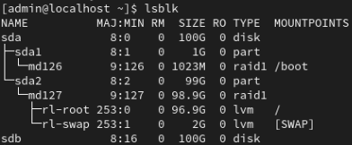
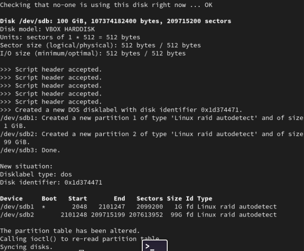
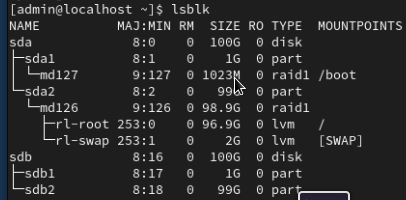
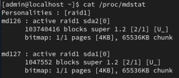
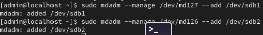
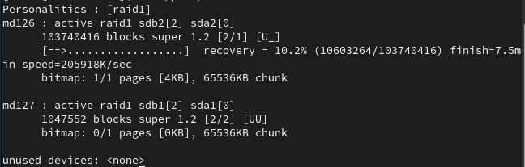

# Guia para agregar un disco a RAID

## Disclaimer

`sda`, `sdb`, `md126` y `md127` son nombres que pueden variar segun el caso.

## Boot

Al agregar / cambiar un disco, el OS se encontrara en un spinner como el de la imagen durante algunos minutos.


Luego, cuando ingresemos a la terminal, ejecutamos el siguiente comando para ver informacion sobre como estan los discos

```
    lsblk
```



Deberiamos ver algo de este estilo. En este caso puntual, `sda` es el disco que tiene formato y esta en RAID 1. `sda1` es la particion /boot que es de tipo `RAID1`, y `sda2` es la particion que contiene / (root) y /swap la cual es de tipo `LVM` y se encuentra en `RAID1`.

## Copiar formato de sda en sdb

Procedemos a copiar el formato de `sda` en `sdb`

```
    sudo sfdisk -d /dev/sda | sudo sfdisk /dev/sdb
```



Ahora, si ejecutamos `lsblk` podemos ver las particiones creadas para `sdb` (`sdb1` y `sdb2`)



Ahora, si ejecutamos

```
cat /proc/mdstat
```



podemos ver todas las configuraciones de raid vigentes y su estado. En este caso podemos ver a `md126` activa en `sda2 (/, /swap)` y `md127` activa en `sda1 (/boot)`, ambas configuraciones tienen \[U*] indicando que una de dos unidades se encuentran activas (en este caso U = sda, * = faltante (disco que reemplazamos)). Procedemos a agregar `sdb` a las mismas configuraciones de raid que `sda`

```
    sudo mdadm --manage /dev/md126 --add /dev/sdb2
    sudo mdadm --manage /dev/md127 --add /dev/sdb1
```



Una vez hecho esto, la configuracion de raid se deberia comenzar a aplicar sobre las particiones indicadas de `sdb`, si queremos ver como progresa podemos ejecutar

```
watch -n 1 cat /proc/mdstat
# Ctrl + C para salir
```



## Instalar GRUB

Una vez que finaliza el proceso, si estamos con `RAID1` nos interesa que el disco que agregamos tambien sea booteable en caso de que `sda` falle, por lo cual instalamos GRUB en `sdb`.

Primero, nos fijamos que GRUB no se encuentre ya instalado en `sdb`. Si GRUB ya se encuentra instalado, el siguiente comando deberia imprimir **GRUB**, en caso contrario, no deberia imprimir nada.

```
    sudo dd if=/dev/sdb bs=512 count=1 2>/dev/null | strings | grep -i grub
```

Para instalar GRUB en `sdb`

```
    sudo grub2-install /dev/sdb
```
