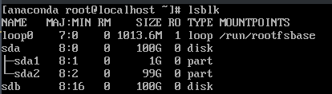
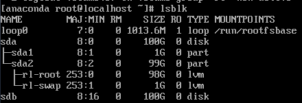
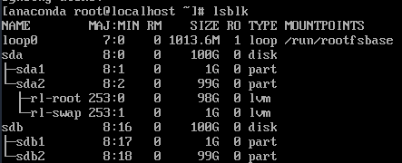
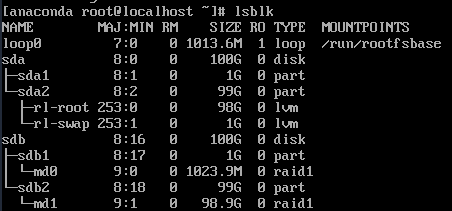
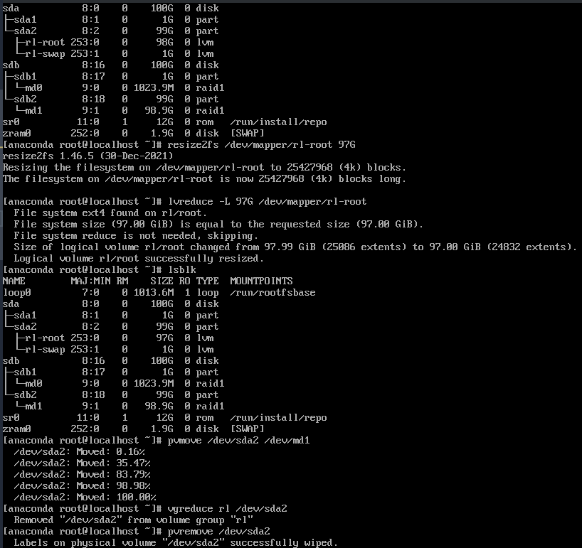
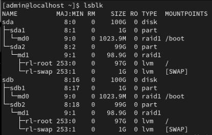

# Guia para armar el esquema de RAID

## Disclaimer

`sda` y `sdb` pueden cambiar al momento de querer seguir estos pasos, quizas sdb es el pendrive que contiene la imagen de rocky linux y nuestro objetivo tenga como label `sdc`

## Guia

Reiniciamos el OS y ejecutamos el rescue shell desde el pendrive que contiene la imagen de rocky linux **(troubleshoot -> rescue a rocky linux system)**.

Primero, listamos el estado actual de los discos.

```bash
lsblk
```



Vemos en la imagen que no estan activos los LVM, los activamos

```bash
# si no estan activos los lvm
vgchange -ay rl
```



Copiamos los formatos de `sda` a `sdb`

```bash
# copiamos los formatos de sda a sdb
sfdisk -d /dev/sda | sfdisk --force /dev/sdb
```



Creamos las particiones de RAID 1 (notar el `--level=1`)

```bash
# cambiamos las particiones de sdb a linux raid auto detect
fdisk /dev/sdb
t
1
fd
t
2
fd
w

# creamos las particiones de raid
# Agregamos el flag --metadata=0.90 para que pueda ser booteable en hardware viejo
mdadm --create /dev/md0 --level=1 --raid-devices=2 missing /dev/sdb1 --metadata=0.90
# No hace falta agregar el flag metadata ya que md1 no contiene a /boot
mdadm --create /dev/md1 --level=1 --raid-devices=2 missing /dev/sdb2
cat /proc/mdstat # opcional
```



Movemos los datos originales a las nuevas particiones RAID. Puede ocurrir que debamos achicar rl-root, el comando resize2fs y lvreduce solo admite numeros enteros (se deberia poder utilizar MB en lugar de GB para minimizar la perdida de espacio pero no se probo)

```bash
# movemos el lvm a sdb
pvcreate /dev/md1
vgextend rl /dev/md1
pvmove /dev/sda2 /dev/md1
# si falla pvmove tenemos q achicar el disco
# ---G es la cantidad de GiB a la que queremos reducir, cambiar ---
# por un valor, ej 127G
# -----
e2fsck -f /dev/mapper/rl-root
resize2fs /dev/mapper/rl-root ---G
lvreduce -L ---G /dev/mapper/rl-root
# retry pvmove
# -----
vgreduce rl /dev/sda2
pvremove /dev/sda2
```



```bash
# copiamos el boot
mkfs.ext4 /dev/md0
mkdir /mnt/new_boot /mnt/old_boot
mount /dev/md0 /mnt/new_boot
mount /dev/sda1 /mnt/old_boot
rsync -aP /mnt/old_boot/ /mnt/new_boot/
umount /mnt/new_boot /mnt/old_boot
```

Reconfiguramos el boot y acoplamos sda a RAID

```bash
# configurar boot
mkdir /mnt/newroot
mount /dev/mapper/rl-root /mnt/newroot
mount /dev/md0 /mnt/newroot/boot
for i in dev proc sys run; do mount --bind /$i /mnt/newroot/$i; done
chroot /mnt/newroot/ /bin/bash
nano /etc/fstab
# deberian quedar
# /dev/mapper/rl-root / [...]
# /dev/md0 /boot [...]
# /dev/mapper/rl-swap none [...]

nano /etc/default/grub
# Buscamos que se cargue RAID antes que los lvm para evitar race conditions
# ya que md1 contiene dentro a rl-root y rl-swap
# cambiamos esta linea
GRUB_CMDLINE_LINUX="rhgb quiet root=/dev/mapper/rl-root rd.lvm.vg=rl rd.auto=1"

# Copiamos la config de mdadm
# Duplicada ante la duda
mkdir -p /etc/mdadm
mdadm --detail --scan > /etc/mdadm/mdadm.conf
mdadm --detail --scan > /etc/mdadm.conf

# agregamos sda a raid
mdadm /dev/md0 --add /dev/sda1
mdadm /dev/md1 --add /dev/sda2
# esperamos q termine de copiar raid
watch -n 1 cat /proc/mdstat

# Limpiamos el cache de lvms
vgchange -ay
pvscan --cache
vgscan --cache

# regeneramos initramfs
DRACUT_KERNEL=$(uname -r)
dracut -f --kver $DRACUT_KERNEL \
    --force-add "mdraid lvm" \
    --omit "multipath" \
    --hostonly \
    /boot/initramfs-$DRACUT_KERNEL.img

# instalamos grub
grub2-install /dev/sda
grub2-install /dev/sdb
grub2-mkconfig -o /boot/grub2/grub.cfg

# salimos
exit
for i in run sys proc dev; do umount /mnt/newroot/$i; done
umount /mnt/newroot/boot
umount /mnt/newroot
reboot
```


